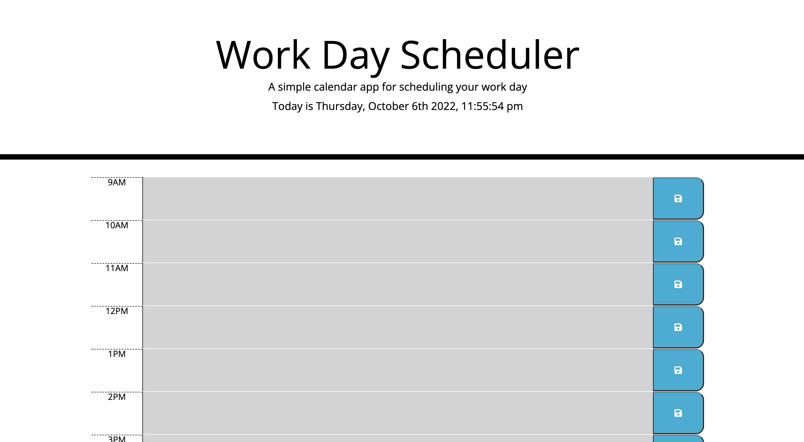

# Work Day Scheduler 

## Languages and Tools Used 
* 
* 
* 
* 
* 
* 
* Moment.js
## Usage

[Live Link]("https://teedaa.github.io/work-day-scheduler/)
## Credits
Pengteda Cheng 
* 
* 
* [Markdown Badges](https://github.com/Ileriayo/markdown-badges)